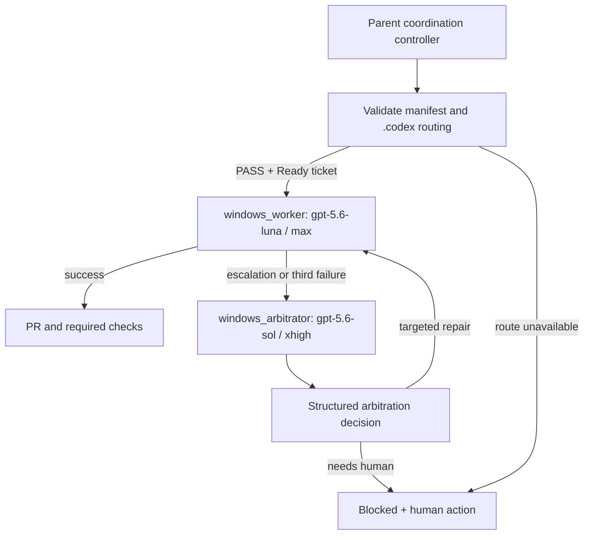
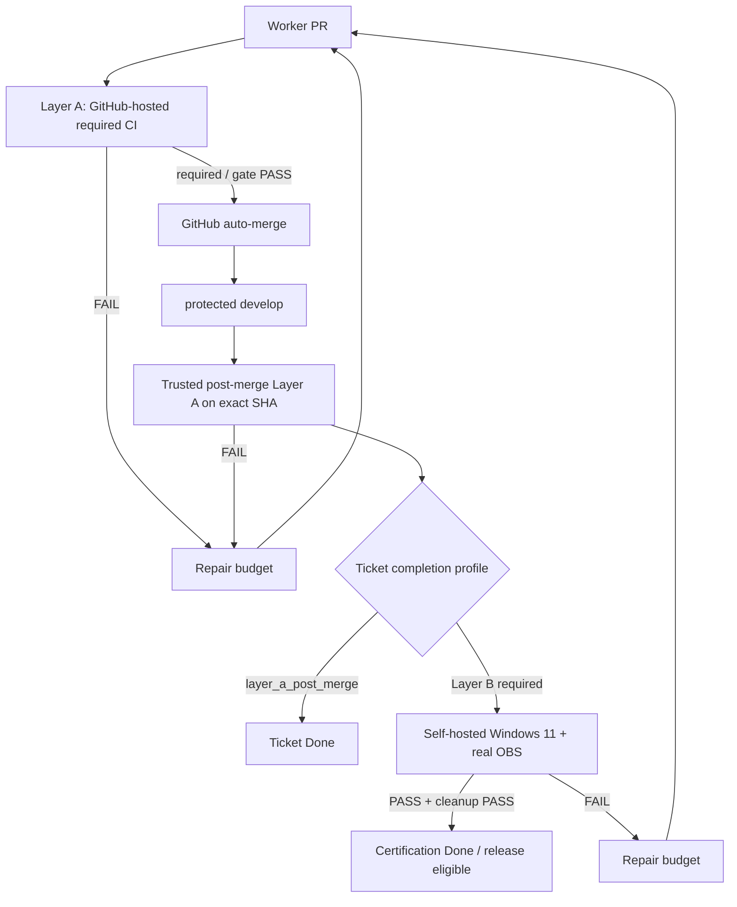
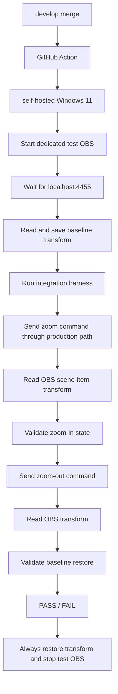

# Windows 11 Delivery Workflow

This document defines the delivery gates for the Windows 11 port. It is a workflow specification; the GitHub Actions files are bootstrapped by W11-001, fully activated by W11-002, hardened by W11-005, administered by W11-009, automated post-merge by W11-010, and activated for real OBS certification by W11-011.

## 0. Runtime model router

The executable router combines the Codex project-agent configuration under `.codex/` with explicit model overrides on every spawn. The parent task is a coordination controller; implementation and arbitration always run in routed child agents.



Routing rules:

- Static preflight: `powershell -NoProfile -ExecutionPolicy Bypass -File tools/validate_model_routing.ps1` must pass before dispatch.
- The controller resolves global defaults first, then applies a ticket's `execution` overrides.
- `windows_worker` is the only default implementation/repair route.
- `windows_arbitrator` is the only planning/arbitration/root-cause route.
- Custom agent files pin both the actual model ID and `model_reasoning_effort`; the parent task's selected model is not inherited for these two routes.
- A client with named custom-agent support dispatches `windows_worker` or `windows_arbitrator`. A spawn interface with only model controls must pass the exact route model and effort explicitly and include the corresponding agent instructions in its prompt.
- Routing is fail-closed. Missing agents, unavailable models, malformed configuration, omitted overrides, or unverifiable spawn metadata block the ticket and do not count as a code failure.
- A CLI-based runner may additionally append `-CheckCli`; this checks authentication, the multi-agent flag, and the model catalog. Desktop execution still requires evidence of either the named custom agent or the exact explicit model and effort overrides.

## 1. Empty-origin initialization gate

The Windows delivery repository is `origin=https://github.com/Wells-Huang/obs-voice-command-windows.git`; the original project is retained as `upstream=https://github.com/htlin222/obs-voice-command.git`. The approved empty-origin seed has created the sole baseline ref `refs/heads/develop` at `de6c588f981596ed13bc9cd0254ad4989a2686b3`, and `develop` is the default branch.

`empty_origin_baseline_seed` was the external non-code predecessor of W11-001 and is now `policy_verified`:

1. For a fresh or repaired repository, keep W11-001 `Blocked` until explicit seed-exception approval and authenticated non-interactive GitHub write/admin authority exist. Set `GIT_TERMINAL_PROMPT=0` for every unattended Git command; never launch browser/device auth or expose credentials.
2. Before any future initialization mutation, re-verify that upstream `develop` is exactly `de6c588f981596ed13bc9cd0254ad4989a2686b3`, the local object is that commit, and the expected remote state matches the manifest. Any drift or unexpected ref returns to arbitration.
3. The only permitted direct-push exception is exactly:

   ```text
   git push --porcelain origin de6c588f981596ed13bc9cd0254ad4989a2686b3:refs/heads/develop
   ```

   `--force`, `--mirror`, `--all`, tags, a local branch as source, any other ref/SHA, and every second direct push are forbidden. The full-OID source guarantees that current uncommitted planning/probe files are excluded.
4. Verify origin now has exactly `refs/heads/develop` at the pinned SHA; set/confirm `develop` as default; enable squash merge and repository auto-merge, disable merge commits/rebase merges, and enable head-branch deletion.
5. Before any W11 branch is pushed, install and read back an active ruleset targeting exactly `refs/heads/develop`: empty bypass list, pull requests required, zero mandatory reviews, linear history, deletion blocked, and non-fast-forward updates blocked.
6. The initial rule cannot require `required / gate` before that check context exists. W11-001 introduces the check through its PR; after the authentic GitHub Actions context appears, add it to the active rule with strict updates and verify provider identity before enabling exact-head squash auto-merge.

Gate states are `seed_not_written`, `baseline_seeded_policy_incomplete`, `policy_verified`, and `unexpected_remote_state_needs_human`. Failure after a correct seed freezes the public upstream baseline and all further pushes until policy is repaired. Unexpected refs or SHA never trigger automatic force-rewrite, deletion, or repository recreation.

## 2. Merge and completion model



The manifest assigns one completion profile per ticket:

- `layer_a_post_merge`: W11-001 through W11-009 require pre-merge `required / gate`, GitHub auto-merge of the exact head SHA, and a distinct trusted `ci.yml` push run that succeeds on the exact merged `develop` SHA.
- `layer_a_post_merge_automated`: W11-010 requires the same evidence, but its authoritative post-merge provider is the newly merged `post-merge.yml` automation.
- `layer_a_plus_layer_b_exact_sha`: W11-011 and W11-012 require authoritative post-merge Layer A plus `windows11-integration / obs-e2e` success and cleanup success on the same exact merged SHA. W11-012 also requires release-readiness evidence.

Layer A always gates GitHub auto-merge. Layer B is never required for a ticket that builds or bootstraps Layer B. A failure affects only the ticket whose completion profile selected that layer and its repair lineage.

## 3. Layer A — ordinary Windows CI

### Trigger and runner

- Events: `pull_request`, `push` to `develop`; add `merge_group` when merge queue is enabled.
- Primary Windows runner: `windows-latest`, Python 3.12.
- macOS regression and package jobs remain required inputs to the same aggregate gate.
- No self-hosted runner is used for pull-request code.

### Required jobs

1. `layer-a / windows-unit`
   - `uv sync --frozen`
   - package import and CLI `--help`
   - config, matcher, zoom, platform selection, Windows ctypes-mock tests
   - hardware-free controller and application component tests
2. `layer-a / macos-regression`
   - locked install and existing macOS behavior/tests
3. `layer-a / package`
   - build wheel/sdist and import the built artifact
4. `required / gate`
   - depends on every required Layer A job
   - runs even when a dependency job fails
   - succeeds only if every required result is successful

### Non-circular bootstrap

- W11-001 introduces `.github/workflows/ci.yml` with the final stable job names. Its explicit `bootstrap` mode tests only the dependency-lazy OBS probe, model-routing validator, manifest consistency, and planning artifacts. It uses pinned actions, `contents: read`, no secrets, no microphone, no model download, and no real OBS.
- Every bootstrap job and artifact must identify `ci_stage=bootstrap`; no later ticket may silently reuse that reduced suite.
- W11-002 adds the Darwin-only Quartz marker, platform seam, `uv.lock`, and `ci_stage=full_activation`. Its PR must remove the bootstrap exemption and make `required / gate` fail unless full mode is active.
- W11-005 hardens the already-active full Layer A suite, validates `merge_group`, and proves that an intentionally failing temporary change makes the aggregate gate fail.
- Through W11-009, the trusted `push` run of `ci.yml` is the temporary post-merge provider. The controller records workflow ID, run URL, check-suite app, merged SHA, and conclusion; only `success` on the exact merged SHA is acceptable.
- W11-010 makes `post-merge.yml` the authoritative post-merge Layer A provider. This avoids requiring a downstream workflow before the ticket that creates it is complete.

### Auto-merge contract

- Protect `develop` with pull requests and required check `required / gate`.
- Require the latest pull-request commit to have current checks.
- Do not permit admin bypass, force push, or direct worker merge.
- GitHub auto-merge may proceed only after the required gate and any configured review/conversation rules pass.
- W11-001 performs the one-time no-browser bootstrap using an out-of-band, non-interactive repository-administration credential: activate a zero-bypass pull-request rule with zero mandatory human reviews first, open the PR, observe the GitHub Actions check context, add `required / gate` from GitHub Actions to the active rule, verify it, then enable squash auto-merge for the exact PR head.
- The rule activation timestamp must precede `mergedAt`. After the separately approved and consumed empty-origin baseline seed, direct push, REST merge, manual merge, `--admin`, and every check bypass are forbidden.

## 4. Layer B — real Windows 11 OBS integration

### Trigger and runner

- W11-010 implements the reusable workflow, harness, cleanup, and repair behavior but does not activate live OBS on every `develop` push.
- W11-011 activates the trusted `push` to protected `develop` trigger for certification commits.
- Optional recovery/debug event: manually approved `workflow_dispatch` for an exact commit.
- Runner labels: `[self-hosted, Windows, X64, obs-integration]`.
- Use an interactive logged-in Windows 11 desktop session. Do not run the OBS integration runner as a non-interactive service session.
- Serialize runs with one concurrency group for the OBS runner; do not cancel an active cleanup sequence.

### Dedicated test environment

- Dedicated OBS executable/version record, test profile, scene collection, and display-capture source.
- WebSocket endpoint `127.0.0.1:4455`; password supplied through a scoped GitHub secret.
- The test scene must not reuse a user's production streaming profile.
- The runner must record Windows build, OBS version, commit SHA, monitor layout, DPI, and source name without exposing secrets.

### Integration sequence



### Harness contract

- Do not use live speech recognition as the command source for the required Layer B gate; inject deterministic zoom commands through the production application/controller boundary.
- Connect to the same production `ObsClient` path used by the application.
- Snapshot the original transform before mutation.
- After zoom-in, poll with a bounded timeout and verify scale and position changed to the expected zoom state.
- After zoom-out, verify position error is at most 0.5 px and scale error is at most `1e-4` from baseline.
- Include a selected-monitor assertion when the self-hosted runner has the declared multi-monitor fixture.
- On any exception or timeout, run cleanup and report both the primary failure and any cleanup failure.
- The Layer B check name is `windows11-integration / obs-e2e`.
- W11-001 through W11-010 must not start dedicated OBS as a completion gate. Their real-OBS probe result may be absent, `MISSING_OBS`, or `UNREACHABLE_ENDPOINT` without consuming retry budget.

## 5. Retry budget and repair loop

The code retry budget is counted by repair lineage, not by individual failed jobs in the same workflow run.

| Consecutive code failure | Automated action | Ticket state | Model |
| --- | --- | --- | --- |
| 1 | Create/update Repair Ticket and apply first repair | Blocked -> Ready/Doing | implementer |
| 2 | Attach both failures and apply second repair | Blocked -> Ready/Doing | implementer |
| 3 | Stop worker dispatch and perform root-cause analysis | Blocked + arbitration requested | arbitrator |
| 4 | Stop all automatic repair and apply `needs-human` | Blocked + needs-human | human decision required |

After third-failure arbitration, the arbitrator records one of: targeted repair instructions, ticket split, dependency/DAG change, rollback, or request for human input. Implementation remains with the implementer unless the user explicitly changes the role policy.

### Retry accounting rules

- Count one code failure per distinct remediation attempt and resulting failing commit.
- Deduplicate workflow reruns for the same commit and failure signature.
- Reset `consecutive_code_failures` only after the complete required workflow for that layer passes on the latest relevant commit.
- Preserve `total_code_failures` for audit history.
- Confirmed runner offline, GitHub outage, unavailable secret, unavailable OBS lab, authentication/authorization failure, or unmet approval gate does not consume the code budget. Retry infrastructure at most twice, then block the owning ticket and its descendants if the external capability cannot be restored safely; independent Ready tickets continue.

## 6. State transitions

- Layer A PASS: PR may auto-merge when every branch rule is satisfied.
- Layer A FAIL: PR cannot merge; use the retry budget.
- Merge completed: Ticket becomes `Merged`, never immediately `Done`.
- Trusted post-merge Layer A PASS on the exact merged SHA: a `layer_a_post_merge` or `layer_a_post_merge_automated` ticket becomes `Done`.
- Layer B PASS plus cleanup PASS on the same exact merged SHA: a `layer_a_plus_layer_b_exact_sha` ticket may become `Done` after any release-readiness conditions are also satisfied.
- Required completion-profile failure: Ticket becomes/stays `Blocked`, a Repair Ticket is Ready for code-attributable failure, and the appropriate retry state advances.
- Fourth code failure: no worker is dispatched until a human explicitly resumes or replaces the ticket.

## 7. Unattended, no-browser execution

- `browser_launch` is forbidden while unattended. Do not open device authorization, OAuth, repository settings, or any other interactive browser flow.
- Allowed authentication sources are an existing authenticated CLI session, an existing scoped token, or existing app credentials. OpenAI/Codex authentication is not evidence of GitHub authentication.
- If a non-interactive credential or permission is missing, mark only the owning external operation and its transitive descendants `Blocked`; do not consume code retries and do not weaken any gate.
- Continue dispatching independent Ready tickets whose dependencies, touch-set constraints, routing, and own approval gates are satisfied.
- Repository-administration credentials remain out of Actions, repository files, logs, artifacts, and model prompts. PR jobs retain `contents: read`; the trusted repair automation uses only the minimum separately documented permissions.
- Unattended mode is fail-closed, not a promise that absent GitHub credentials, admin permission, release approval, or a Windows 11 hardware lab can be manufactured automatically.

## 8. Ticket ownership

- W11-001 bootstraps `ci.yml`, the stable job names, and the initial zero-bypass repository rule/auto-merge evidence.
- W11-002 activates the full cross-platform CI mode and lock; W11-005 hardens Layer A and its stable aggregate required check.
- W11-009 audits and hardens branch protection, required checks, merge queue/auto-merge, and PR policy after the bootstrap.
- W11-010 implements authoritative post-merge Layer A, the inactive Layer B workflow/harness, Repair Ticket creation, deduplication, and retry enforcement.
- W11-011 activates Layer B on trusted certification pushes and records the real Windows 11 evidence.
- W11-012 validates both exact-SHA layers again for the release candidate; tag and GitHub Release publication remain separately approval-gated.
