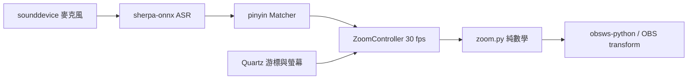
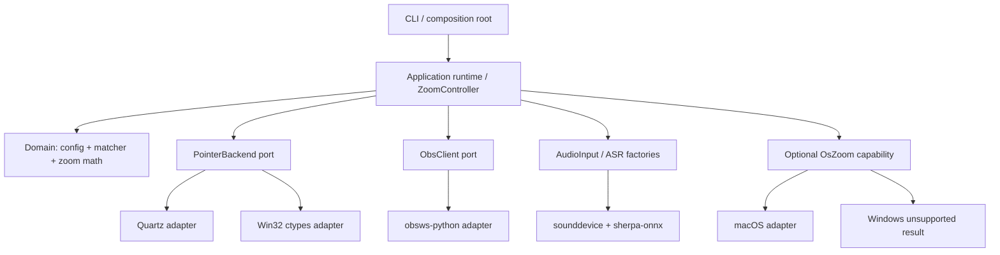
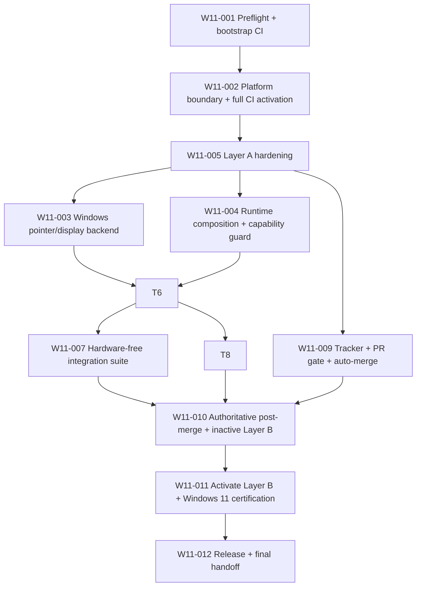
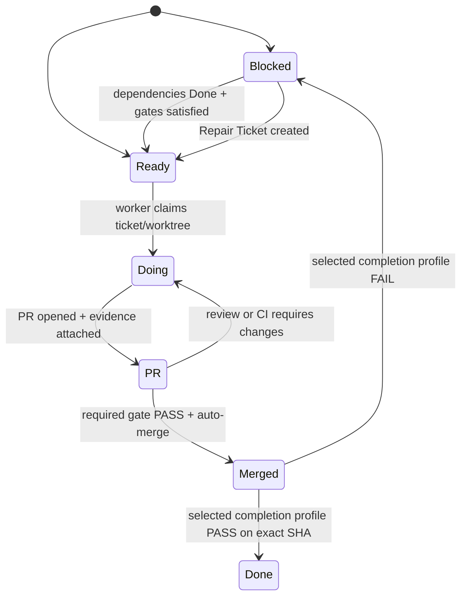

# Windows 11 移植：高階規劃與 Ticket DAG

- 日期：2026-08-17
- 狀態：Planning amended after Sol xhigh bootstrap arbitration；W11-001 local evidence exists，remote promotion not started
- 目標分支：`develop`
- 基準 commit：`de6c588f981596ed13bc9cd0254ad4989a2686b3`
- Windows origin：`https://github.com/Wells-Huang/obs-voice-command-windows.git`（已確認存在但無 refs／HEAD）
- Read-only upstream：`https://github.com/htlin222/obs-voice-command.git`
- 動態 tracker bootstrap：`docs/plans/2026-08-17-windows-11-ticket-manifest.yml`

## 1. Goal 與範圍決策

### Goal

讓 `obs-voice-command` 在 Windows 11 上，以本機中文串流 ASR 接收語音指令，透過 OBS WebSocket 對「顯示器擷取」來源執行 zoom-to-mouse，並持續追蹤正確的擷取螢幕游標；同時保留既有 macOS 行為。

### Windows MVP 納入範圍

1. Windows 11 x64、Python 3.12、OBS 28+／obs-websocket 5.x。
2. OBS transform 模式：`zoom_in`、`zoom_out`、平滑、deadzone、斷線恢復及退出復原。
3. 單螢幕與多螢幕；支援負座標排列及 mixed-DPI。
4. Windows 麥克風、ASR 模型下載／快取、`--list-devices`、`--dry-run`。
5. macOS regression protection。
6. PR CI、required checks、auto-merge、develop post-merge CI，以及失敗時建立 Repair Ticket。

### 明確不納入 Windows MVP

1. 不移植 macOS `--os` 輔助使用 Zoom 到 Windows Magnifier。Windows 執行 `--os` 必須在下載模型、開麥克風或連 OBS 前，以清楚訊息和非零 exit code 結束。
2. 不支援任意 crop、rotation、非等比或未鋪滿 canvas 的顯示器來源。MVP 對不支援的 transform 必須 fail fast，不可產生錯誤縮放。
3. 不把程式改寫成 OBS 原生 plugin。
4. 不安裝或修改全域 Python、PATH、套件管理器設定；所有相依項目維持 project-local 並鎖版。

## 2. Repository 理解與現況

### 現有資料流

### 現有 boundary

| 區域 | 現況 | 移植判斷 |
| --- | --- | --- |
| Domain | `config.py`、`matcher.py`、`zoom.py` 大致為平台中立 | 保留，擴充測試，不重寫 |
| Application | `main.py` 同時負責 composition、音訊、ASR、OBS、thread 與 lifecycle | 建立可注入 seam，避免硬體測試綁死 |
| Pointer adapter | `mouse.py` 頂層直接 `import Quartz` | 拆成平台 facade + macOS／Windows adapter |
| OS zoom adapter | `os_zoom.py` 頂層直接 `import Quartz` 並執行 macOS `defaults` | 改成 lazy capability；Windows 明確 unsupported |
| ASR adapter | macOS dylib workaround 在所有平台執行探測 | 只在 `sys.platform == "darwin"` 執行 |
| OBS adapter | 只識別 `display_capture`／`screen_capture` | Windows 必須識別 `monitor_capture` 並讀 `monitor_id` |
| Packaging | Quartz 依賴無 platform marker，沒有 `uv.lock` | 加 PEP 508 marker並提交跨平台 lock |
| Tests | 純函數覆蓋尚可；無 ObsClient、controller、CLI、Windows backend 測試 | 補 unit、component、hardware-free integration 與手動 E2E |
| Delivery | 無 `.github/workflows`、PR template、required gate | 建立穩定 gate 與 post-merge repair loop |

### 已知 correctness gap

1. `ZoomController` 目前把游標所在的任何螢幕都換算成 source 座標，沒有確認該螢幕就是 OBS 正在擷取的螢幕。
2. Windows OBS 的顯示器擷取 input kind 是 `monitor_capture`；目前自動偵測不會命中。
3. Windows OBS source settings 使用 `monitor_id`。OBS 自身以 `EnumDisplayDevices(..., EDD_GET_DEVICE_INTERFACE_NAME)` 產生 device interface ID，失敗時 fallback 到 `MONITORINFOEX.szDevice`；Windows adapter 必須採同一 identity contract。
4. 現有 transform 數學只對「未 crop／未 rotation／鋪滿 canvas」的來源有明確保證；MVP 先驗證此前提。
5. repository 沒有 lock file 或 CI，因此目前不存在可設定為 required check 的穩定 check name。
6. 本機有 `uv 0.11.8` 與可重用的 bundled Python 3.12，但沒有 project-local `.venv` 或 lock；不得因 PATH 上的 Python 3.10 而修改全域設定，建立或下載 runtime 前仍需相應批准。
7. Windows origin 已以精確 baseline SHA 建立 `develop`，目前 repository 是 public，初始 zero-bypass policy 已完成：active Ruleset `20990581` 的 bypass list 為空，auto-merge 與 squash-only 設定已讀回成功。本機沒有 `gh` CLI；既有 Git Credential Manager credential 已驗證具備 `push`／`maintain`／`admin` 權限。Codex/OpenAI 登入與 public `ls-remote` 本身仍不算權限證據。

## 3. 目標 architecture boundary

採「小型 ports-and-adapters seam」，不進行全面架構重寫。

### Platform-neutral display contract

`DisplayInfo` 應描述：

- stable `id` 與 `aliases`；
- virtual desktop 上的 physical-pixel rectangle，可包含負 `origin_x`／`origin_y`；
- `width_px`／`height_px`；
- primary flag；
- 平台 adapter 所需但 domain 不解讀的 metadata。

`PointerBackend` 至少提供：

- `list_displays() -> list[DisplayInfo]`
- `get_cursor_position() -> Point`，與 `DisplayInfo` 使用相同座標空間
- `initialize_coordinate_space()`，Windows 需在任何座標 API 前設定 Per-Monitor V2 DPI awareness

Windows 實作優先使用標準庫 `ctypes` 呼叫 `SetProcessDpiAwarenessContext`、`GetCursorPos`、`EnumDisplayMonitors`、`GetMonitorInfoW`、`EnumDisplayDevicesW`，避免新增 `pywin32`；若 W11-001 實測證明 ctypes 無法滿足契約，才由 Planner 核准變更依賴。

## 4. Windows 11 移植完成條件（Definition of Done）

全部條件均須成立：

1. 從乾淨 clone 以文件化 PowerShell 指令建立 project-local 環境；`uv sync --frozen` 在 Windows 11 與 macOS CI 都成功。
2. Windows 安裝不解析或安裝 `pyobjc-framework-Quartz`；macOS 仍安裝並使用 Quartz。
3. Windows 可執行 `--help`、`--list-devices`、`--dry-run` 與預設 OBS mode，且 import 階段沒有 Quartz／macOS command error。
4. `--os` 在 Windows 於任何模型下載、麥克風或 OBS side effect 前，以明確 unsupported 訊息結束。
5. Windows 單螢幕、負座標多螢幕、100%／125%／150%／200% mixed-DPI 坐標測試通過。
6. 選定的 OBS source 是 Windows `monitor_capture` 時，可從 source settings 的 `monitor_id` 對應至 Win32 display；游標移到非擷取螢幕不改變 zoom center。
7. scene 中有多個候選顯示器來源且未設定 `source` 時，程式拒絕猜測並列出可設定的來源名稱。
8. 不支援的 crop／rotation／非鋪滿 transform 在啟動時 fail fast；支援的來源在 zoom out、Ctrl-C、OBS reconnect 後精確復原原始 transform。
9. 既有 matcher、zoom、config 與 macOS pointer tests 全數通過；新增 Windows backend、ObsClient contract、controller lifecycle 與 hardware-free pipeline tests。
10. PR required check `required / gate` 成功才可 auto-merge；workflow 同時支援 `pull_request`，若使用 merge queue 也支援 `merge_group`。
11. Ticket 依 manifest 的 `completion_profile` 由 Merged 轉 Done；所有 profile 都要求 exact merged SHA 的 trusted post-merge Layer A，只有 W11-011／W11-012 另要求同 SHA Layer B。失敗時建立去重的 Repair Ticket，附 commit、workflow run 和失敗 check。
12. Windows 11 實機 E2E evidence 完成，README 有完整安裝、OBS 設定、麥克風權限、多螢幕限制與 troubleshooting。

## 5. Epic 拆分

| Epic | 目的 | Tickets |
| --- | --- | --- |
| E0 Preflight | 建立最小 CI bootstrap、確認 runtime／GitHub 能力並提供只讀 OBS probe | W11-001 |
| E1 Platform foundation | 切開平台 import、相依與 coordinate boundary | W11-002、W11-003 |
| E2 Runtime portability | 建立可測 composition、CLI capability 與 ASR guard | W11-004 |
| E3 OBS correctness | 正確找出 Windows display capture 與擷取螢幕 | W11-006 |
| E4 Verification | lock、cross-platform CI、component tests、實機認證 | W11-005、W11-007、W11-011 |
| E5 Delivery UX | Windows 文件與安全的設定流程 | W11-008 |
| E6 Orchestration | tracker、PR gate、auto-merge、post-merge repair loop | W11-009、W11-010 |
| E7 Release | 版本、乾淨安裝驗證與 handoff | W11-012 |

## 6. Ticket dependency DAG

可平行區段：

- W11-003、W11-004 在 W11-005 完成 Layer A hardening 後可由不同 worker 同時進行。
- W11-007、W11-008 在 W11-006 合併並完成其 post-merge profile 後可平行。
- 單一 ticket 因 auth／admin／硬體 gate Blocked 時，只封鎖其 descendants；orchestrator 繼續其他獨立 Ready tickets。

### Empty origin external predecessor gate

`empty_origin_baseline_seed` 不是 implementation ticket，也不走 PR completion profile；它是 W11-001 之前的一次性外部初始化 gate。

1. 目前 state 為 `policy_verified`。使用者已明確批准且 seed exception 已消耗；origin 只有 `refs/heads/develop`，tip 與 pinned SHA 完全相同。
2. Seed 後已確認 origin `HEAD` 與唯一 ref 都指向 `de6c588f981596ed13bc9cd0254ad4989a2686b3`。任何後續 drift／unexpected ref 回 Sol xhigh 仲裁。
3. 唯一允許的 seed command 是 `git push --porcelain origin de6c588f981596ed13bc9cd0254ad4989a2686b3:refs/heads/develop`。禁止 force、mirror、all、tags、local branch source、其他 ref/SHA 與第二次 direct push。
4. Seed 只傳輸該既有 commit 的 reachable upstream history；目前工作樹中的 `.gitignore`、planning、routing、probe、validation、tests 和 CI 草稿不得進入 seed。
5. Seed 後已將 `develop` 設為 default，並設定 squash-only、停用 merge/rebase merge、啟用 auto-merge 與 merge 後刪除 head branch。
6. Active `develop-zero-bypass` ruleset `20990581` 已讀回：empty bypass、zero-review、PR-required、只允許 squash、linear-history、禁止 deletion／non-fast-forward。Gate 已到 `policy_verified`；W11-001 可轉 Ready。不得用 Actions admin bot、direct push 或停用 required checks 替代。

## 7. Ticket 規格

### W11-001 — Preflight、baseline 與 Windows OBS contract probe

- 初始狀態：Blocked；`empty_origin_baseline_seed=policy_verified` 後才轉 Ready
- Depends on：無
- External predecessor：`empty_origin_baseline_seed`
- Completion profile：`layer_a_post_merge`；CI stage：`bootstrap`
- 建議 touch set：`docs/validation/`、只讀 probe 與 tests、`.github/workflows/ci.yml`
- 目標：建立可被 GitHub Actions 判斷的最小非循環 bootstrap，並把 live OBS 驗證明確延後到 W11-011。

Acceptance criteria：

1. 記錄可讀取的 Windows build/product、OBS installation、Python／uv、monitor rectangles、DPI 與 primary monitor；矛盾或未知值原樣標記，不宣稱完成 Windows 11 certification。
2. 提供 dependency-lazy、只讀、遮蔽敏感資料的 OBS contract probe 與 hardware-free tests。`MISSING_OBS`／`UNREACHABLE_ENDPOINT` 是可接受的 preflight evidence；`GetSceneItemList`、`GetInputSettings`、`monitor_id` 與 transform 的必備 live evidence移至 W11-011。
3. 新增 `.github/workflows/ci.yml`，以最終固定名稱輸出 `layer-a / windows-unit`、`layer-a / macos-regression`、`layer-a / package`、`required / gate`；bootstrap mode 只驗證 probe、routing、manifest 與 planning artifacts，且清楚寫入 summary/artifact。
4. Bootstrap workflow 使用 GitHub-hosted runner、pinned actions、`contents: read`、無 secrets；不得安裝仍受 Quartz 阻擋的 Windows product、啟動 OBS、下載 ASR model 或開啟麥克風。
5. 在 W11-001 branch／PR 前，external gate 已將 pristine baseline seed 到 origin、設為 default，並讀回驗證 active、zero-bypass、零 mandatory human review、要求 PR／strict update／linear history／禁止 force-push 與 deletion 的 `develop` rule。
6. W11-001 branch 必須從 exact seeded `origin/develop` 建立；所有目前未提交 planning／routing／probe／validation／test／`.gitignore`／bootstrap CI 檔只能由此 PR 進入。
7. PR 產生 authentic GitHub Actions check context 後，將其 `required / gate` 加到 active rule並驗證 provider；只允許 exact head SHA 的 GitHub squash auto-merge。除已消耗的 seed exception 外，禁止 direct push、REST/manual/admin merge。
8. 另一次 trusted `push` workflow 必須在 exact merged `develop` SHA 回報 success，才可 Done；所有 baseline test 與 remote evidence／blocker都必須精確記錄。

Tests/evidence：preflight Markdown、probe unit tests、bootstrap CI run URL／workflow ID／check-suite app／head SHA／merged SHA、ruleset active timestamp、auto-merge evidence、敏感欄位確認已遮蔽。

### W11-002 — Platform boundary 與條件式依賴

- 初始狀態：Blocked
- Depends on：W11-001
- Completion profile：`layer_a_post_merge`；CI stage：`full_activation`
- 建議 touch set：`pyproject.toml`、`uv.lock`、`.github/workflows/ci.yml`、pointer platform facade／common model、相關 tests
- 目標：Windows import 不再載入 Quartz，同時保持 macOS API 行為。

Acceptance criteria：

1. `pyobjc-framework-Quartz` 使用 `sys_platform == 'darwin'` marker，並提交可在 Windows/macOS 使用的 `uv.lock`。
2. 平台中立的 `DisplayInfo`、point conversion 與 backend interface 不 import Quartz／Win32。
3. macOS Quartz 程式只存在 macOS adapter；Windows／unsupported adapter 可安全 import。
4. Windows 上 `import obs_voice_command.main` 與 `obs-voice-command --help` 成功。
5. 既有 `locate` 行為與 macOS tests 保持通過。
6. 移除 W11-001 bootstrap exemption，將 workflow 設為 `ci_stage=full_activation`；若 full mode 未啟用，`required / gate` 必須失敗。
7. PR 上完成 Windows/macOS locked install、相關 tests、package build/import，並由 trusted `push` run 在 exact merged SHA 再次成功。

Required tests：platform selection、import smoke、display common geometry、macOS adapter mock。

### W11-003 — Windows pointer/display backend

- 初始狀態：Blocked
- Depends on：W11-005
- Completion profile：`layer_a_post_merge`；CI stage：`full`
- 建議 touch set：Windows adapter 與其 tests
- 目標：建立與 OBS monitor identity 相容的 physical-pixel coordinate backend。

Acceptance criteria：

1. 在任何 monitor/cursor query 前請求 Per-Monitor V2 DPI awareness；已被設定時可判別並安全繼續，其他失敗提供 Win32 error。
2. `EnumDisplayMonitors` + `GetMonitorInfoW` 正確回傳 virtual desktop rectangles，保留負座標。
3. `EnumDisplayDevicesW(..., EDD_GET_DEVICE_INTERFACE_NAME)` 產生 OBS-compatible stable ID，並保留 `szDevice` alias。
4. `GetCursorPos` 與 display rectangles 共用 physical-pixel 座標空間。
5. API failure 不回傳假座標，必須 raise 可診斷例外。
6. 不新增 pywin32；若必須新增，先回到 Planner gate。

Required tests：mock Win32 success/failure、負座標、邊界點、主螢幕、100/125/150/200% mixed-DPI contract、真機 read-only smoke。

### W11-004 — Runtime composition、CLI capability 與 lifecycle seam

- 初始狀態：Blocked
- Depends on：W11-005
- Completion profile：`layer_a_post_merge`；CI stage：`full`
- 建議 touch set：`main.py`、`asr.py`、OS zoom facade、runtime/controller tests
- 目標：將硬體與 platform side effects 移到 composition root，讓 controller 可單元測試。

Acceptance criteria：

1. pointer、OBS client、audio stream、ASR、clock/sleep 皆可由 tests 注入 fake。
2. macOS OS zoom lazy import；Windows `--os` 在任何模型、音訊或 OBS side effect 前 exit non-zero。
3. sherpa-onnx dylib workaround 僅在 Darwin 執行。
4. `--list-devices` 不載入 ASR 模型、不連 OBS。
5. Ctrl-C、正常退出、controller stop、OBS reconnect 的 restore path 有 deterministic tests。
6. CLI flags 與既有預設行為向後相容。

Required tests：CLI dispatch、unsupported capability、controller state、reconnect/restore、side-effect ordering。

### W11-005 — Full Layer A required gate hardening

- 初始狀態：Blocked
- Depends on：W11-002
- Completion profile：`layer_a_post_merge`；CI stage：`full`
- 建議 touch set：`uv.lock`、`.github/workflows/ci.yml`
- 目標：強化 W11-002 已啟用的 full Layer A，不改變穩定 check 名稱。

Acceptance criteria：

1. 驗證 cross-platform `uv.lock`，CI 使用 `uv sync --frozen`，且 bootstrap exemption 已不存在。
2. matrix 至少包含 `windows-latest` + Python 3.12、`macos-latest` + Python 3.12。
3. 執行 unit/component tests 與 package build/import smoke；PR gate 不下載 488MB ASR model、不要求麥克風或 OBS。
4. 保持固定名稱 `required / gate` aggregate job，只有所有必要 jobs 成功才通過。
5. workflow 監聽 `pull_request`、`push` to `develop`；若 merge queue 啟用，也監聽 `merge_group`。
6. CI 失敗保留足以定位平台、Python、command 與 failing test 的 log。

Required tests：在 PR 上實際跑過兩個 OS matrix，並以一個刻意失敗的臨時 commit 驗證 aggregate gate 會 fail，驗證後移除該 commit 內容。

### W11-006 — Windows OBS capture resolver 與 monitor mapping

- 初始狀態：Blocked
- Depends on：W11-003、W11-004
- Completion profile：`layer_a_post_merge`；CI stage：`full`
- 建議 touch set：`obs_client.py`、capture mapping model、相關 tests；必要時 `config.py`
- 目標：只追蹤 OBS 實際擷取的 Windows monitor。

Acceptance criteria：

1. source kinds 支援 `monitor_capture`、`display_capture`、`screen_capture`。
2. `source` 設定存在時 exact match；沒有設定且只有一個候選時自動選；多個候選時 fail 並列出名稱。
3. Windows 對選中 source 呼叫 `GetInputSettings` 取得 `monitor_id`，以 stable ID 或 `szDevice` alias 對應 Win32 display。
4. 無法 mapping 時 fail fast，訊息包含 source、kind、已遮蔽設定摘要與可用 display IDs，不可用解析度猜測。
5. controller 只接受 capture display；游標在其他 monitor 時凍結 center。
6. 驗證 rotation=0、crop=0、等比且鋪滿 canvas；不符時拒絕啟動。
7. 既有 macOS source flow 保持可用。

Required tests：fake obsws responses、Windows kind/settings、stable ID fallback、零/一/多候選、非擷取螢幕、unsupported transform。

### W11-007 — Hardware-free application integration suite

- 初始狀態：Blocked
- Depends on：W11-006
- Completion profile：`layer_a_post_merge`；CI stage：`full`
- 建議 touch set：`tests/fakes/`、application/component tests
- 目標：在 CI 不需要模型、麥克風或 OBS，也能驗證完整 command-to-transform lifecycle。

Acceptance criteria：

1. fake audio/ASR 送出 zoom in/out sequence，fake OBS 收到正確 transform sequence。
2. fake pointer 驗證 deadzone、capture-monitor tracking 與 non-capture freeze。
3. fake OBS 斷線後重連，先復原 original transform 再回 idle。
4. Ctrl-C／normal stop 均復原；測試無真實 `sleep`，無 timing flake。
5. 每個 regression 可由單一 test name 重跑。

Required tests：pipeline positive/negative、duplicate trigger、disconnect/reconnect、shutdown restore、wrong-monitor freeze。

### W11-008 — Windows 使用文件與設定 UX

- 初始狀態：Blocked
- Depends on：W11-006
- Completion profile：`layer_a_post_merge`；CI stage：`full`
- 建議 touch set：`README.md`、`config.example.toml`、Windows troubleshooting doc
- 目標：讓 Windows 使用者依照畫面可見標籤完成安裝與 OBS 設定。

Acceptance criteria：

1. 支援矩陣清楚區分 Windows OBS mode、macOS OBS mode、macOS-only `--os`。
2. 提供 PowerShell exact commands：project-local sync、複製 config、列出麥克風、dry-run、正式啟動、停止。
3. OBS 步驟使用可見 UI 名稱：工具 → WebSocket 伺服器設定、啟用、port、password、顯示器擷取 source。
4. 說明 Windows 設定 → 隱私權與安全性 → 麥克風，以及多來源時設定 `source`。
5. 說明首次模型下載、快取位置、離線後續執行與磁碟需求。
6. troubleshooting 含 Python 缺失、Quartz 不應被安裝、PortAudio device、WebSocket、monitor mapping、unsupported transform。

Tests/evidence：全新 PowerShell session 逐行 smoke；README commands 與 CLI `--help` 一致。

### W11-009 — Ticket tracker、PR gate 與 auto-merge

- 初始狀態：Blocked
- Depends on：W11-005
- Completion profile：`layer_a_post_merge`；CI stage：`full`
- 建議 touch set：`.github/PULL_REQUEST_TEMPLATE.md`、issue forms／labels bootstrap、repository settings evidence
- 目標：把 Ready → Done 狀態與 required checks 接到 GitHub PR 流程。

Acceptance criteria：

1. 以 `github_policy_admin` gate 稽核並強化 W11-001 建立的 `develop` ruleset／branch protection：PR required、GitHub Actions 提供的 `required / gate` required、零 bypass、禁止 force push/deletion、resolve conversations、linear history。
2. 優先使用 merge queue；方案不提供時，要求 branch up to date 並使用 GitHub auto-merge。兩種情況都只能在 required gate 通過後 merge。
3. 啟用 squash merge、auto-merge、merged branch auto-delete。
4. PR template 強制填 Ticket ID、dependencies、acceptance evidence、test commands、manual checks、risk/rollback。
5. tracker 使用精確狀態：Ready、Blocked、Doing、PR、Merged、Done；Repair Ticket 使用同一狀態機並加 `type:repair`。
6. worker branch 為 `codex/w11-<ticket>-<slug>`，一個 worktree／branch／PR 只處理一張 ticket。

Tests/evidence：ruleset export或設定截圖、成功 auto-merge 範例、required check fail 時無法 merge 的證據。

### W11-010 — Develop post-merge CI 與 Repair Ticket loop

- 初始狀態：Blocked
- Depends on：W11-007、W11-008、W11-009
- Completion profile：`layer_a_post_merge_automated`；CI stage：`post_merge_automation`
- 建議 touch set：post-merge workflow、inactive Layer B workflow/harness、repair issue form／automation
- 目標：讓 post-merge Layer A 成為權威 provider，並建立尚未對每次 push 啟動真 OBS 的 Layer B harness。

Acceptance criteria：

1. 每次 push to `develop` 由 `post-merge.yml` 跑與 PR 相同的 required suite；不得只依賴 PR result，W11-010 merged SHA 必須由新 provider 自我驗證成功。
2. PASS：`layer_a_post_merge_automated` ticket 從 Merged 轉 Done，記錄 exact develop commit、workflow ID、check-suite app 與 run URL。
3. FAIL：建立或更新去重 Repair Ticket，包含 failing commit、run URL、job/test、最近合併 PR、rollback hint；狀態 Ready。
4. repair workflow 使用最小權限 `contents: read`、`issues: write`；不使用長效 PAT，除非 GitHub token 權限不足且使用者批准。
5. 同一 commit／workflow run 重跑不建立重複 ticket。
6. Repair PR 仍必須走相同 required checks 與 auto-merge，不得 bypass。
7. 可提交 Layer B reusable/manual workflow、integration harness、always-run cleanup 與 hardware-free tests，但不得在此 ticket 把 real OBS 設為每次 `develop` push 的 active completion gate。

Tests/evidence：在測試 branch/workflow 中模擬一次 PASS、一次 FAIL、一次 rerun，驗證狀態與去重。

### W11-011 — Windows 11 實機 E2E certification

- 初始狀態：Blocked
- Depends on：W11-010
- Completion profile：`layer_a_plus_layer_b_exact_sha`；CI stage：`layer_b_activation`
- 建議 touch set：`docs/validation/windows-11-e2e-<date>.md`、`.github/workflows/windows11-integration.yml`
- 目標：在真實 Windows 11 + OBS + mic 上證明 Definition of Done。

Acceptance criteria：

1. 只在 trusted `push`／authorized exact-commit dispatch 啟用 Layer B；同一 exact merged SHA 的 authoritative Layer A、`windows11-integration / obs-e2e` 與 cleanup 都必須 success。
2. 啟動 dedicated test OBS、等待 `127.0.0.1:4455`，讀取並保存已遮蔽的 `GetSceneItemList`、`GetInputSettings`、`monitor_id` 與 baseline transform evidence。
3. 記錄硬體、Windows build、OBS／obs-websocket、Python、uv、麥克風、monitor layout、DPI 與 source transform。
4. 單螢幕與至少一組雙螢幕 mixed-DPI；包含左側或上方負座標排列。
5. 每個預設正向 phrase 10 次皆觸發；至少 10 個負向 utterances 為 0 false trigger。
6. 10 次中至少 9 次在 phrase 結束後 1.5 秒內開始 transform；記錄測量方法，不憑感覺填寫。
7. 游標在 capture monitor 時追蹤；移到其他 monitor 時 center 不跳動。
8. zoom out、Ctrl-C、OBS reconnect 後 position 誤差 ≤ 0.5 px、scale 誤差 ≤ 1e-4。
9. `--list-devices`、named device、`--dry-run`、首次模型下載與第二次 cache hit 皆驗證。
10. 測試不自動重開機，不改 driver、BIOS、全域 PATH 或共用 runtime。

### W11-012 — Release、版本與最終 handoff

- 初始狀態：Blocked
- Depends on：W11-011
- Completion profile：`layer_a_plus_layer_b_exact_sha`；CI stage：`release_candidate`；另需 release-readiness evidence
- 建議 touch set：version metadata、README/CITATION、release notes、handoff
- 目標：把 Windows support 形成可重現的 0.3.0 release candidate。

Acceptance criteria：

1. 版本由 0.2.1 升至 0.3.0，description 不再宣稱 macOS-only，support matrix 明確。
2. 乾淨 clone 在 Windows/macOS 使用 lock file 安裝、build、unit/component tests 成功。
3. release notes 列出 Windows support、`--os` 邊界、已知限制、升級與 rollback。
4. 所有 W11 tickets Done，沒有 open blocker；Repair Tickets 已 Done 或明確阻擋 release。
5. tag／GitHub Release 是外部寫入，須取得使用者明確批准後才執行。

## 8. Test strategy

### PR-required、無硬體測試

| Layer | 驗證內容 | 平台 |
| --- | --- | --- |
| Unit | config、matcher、zoom math、common geometry | Windows + macOS |
| Adapter unit | Win32 ctypes mock、Quartz mock、platform selection | 對應 OS + pure mocks |
| Contract | OBS response parsing、source selection、monitor ID mapping、transform validation | Windows + macOS |
| Application component | fake audio/ASR/pointer/OBS；trigger、reconnect、restore | Windows + macOS |
| Packaging | `uv sync --frozen`、build、CLI import/help | Windows + macOS |

### 非 required、需要網路或硬體

1. ASR model download/cache smoke：manual 或 scheduled，避免每個 PR 下載大型模型。
2. 真麥克風與 Windows privacy permission。
3. 真 OBS WebSocket 與 display capture；只在 W11-011／W11-012 的 Layer B completion profile 成為 required evidence。
4. Mixed-DPI、多螢幕及負座標。
5. 語音準確率與 command-to-transform latency。

### Regression policy

- 每個發現的 Windows bug 先加入會失敗的最小測試，再修正。
- macOS regression 不允許以 skip 整個 suite 來繞過；只能對確實需要 macOS runtime 的 adapter test 使用明確 marker。
- required gate 不允許 `continue-on-error`。
- flaky test 第一次重跑只用於蒐證；不可把 retry 當作長期通過條件。

## 9. Ticket Tracker 與 Orchestrator 規則

### 狀態轉移

### Orchestrator invariants

1. 只派發 status=Ready 且所有 `depends_on`=Done 的 ticket。
2. 派發前確認 worker 的 `touch_set` 不與 Doing／PR ticket 重疊；重疊時序列化。
3. 每張 ticket 從最新 `develop` 建立獨立 worktree 與 `codex/` branch。
4. worker 不擴張 scope；需要新依賴、改完成條件或碰另一 ticket touch set 時，回 Planner 建立／重排 ticket。
5. worker 必須提交：code、tests、acceptance evidence、精確 commands、風險與 rollback。
6. PR 不是 Done；只有 manifest 選定的 `completion_profile` 在 exact merged SHA 取得完整證據才 Done。Layer B 不得套用到 W11-001～W11-010。
7. post-merge 失敗時，原 ticket 保持 Merged/Blocked，Repair Ticket 進 Ready，由新 worker 處理。
8. `needs-human`、auth、admin、shared-runtime 或 hardware gate 只 block owning ticket 與 descendants；其餘獨立 Ready tickets 繼續。
9. Unattended mode 禁止開瀏覽器／device-auth；只使用 existing CLI session、existing scoped token 或 existing app credential，且不得把 secret 寫入 repo、log、artifact 或 prompt。
10. 不自動安裝 shared runtime、不未經批准修改 GitHub settings、不自動發布 release。唯一 direct-push 例外是 manifest 中經明確批准的 `empty_origin_baseline_seed`；其成功後永久消耗，任何後續 direct push、manual/REST/admin merge 或 check bypass 都禁止。

## 10. 開發啟動 gate

Luna Max 開始開發前，依序確認：

1. 先執行 routing validator，再從 W11-001 開始；不要越過未 Done 的 dependency。
2. W11-001 只有在 `empty_origin_baseline_seed` 已完成且 external gate state=`policy_verified` 時才轉 Ready；目前 seed、authority 與 policy gate 均已驗證，manifest 已將 W11-001 設為 Ready。若之後改回 private，必須重新驗證 GitHub 方案是否仍支援這些 controls；不得以繞過方式替代。
3. W11-001 bootstrap 可重用既有 bundled Python 3.12；只有需要建立／下載 project-local runtime 時才觸發 approval，絕不改 PATH 或全域 Python。
4. 外部 gate Blocked 時，orchestrator 繼續其他已獨立 Ready 的 tickets；如果初始 DAG 沒有其他 Ready ticket，就安全停止並留下精確 blocker，不能聲稱仍在長跑。
5. `develop` 是否仍指向基準或已前進；若已前進，重新跑 architecture-drift check，不可盲套本 plan。
6. 工作樹是否乾淨；任何既有未提交變更都視為使用者資產，不覆蓋。

## 11. Luna Max 開發交接提示

下一個對話可直接使用：

> 請以 `docs/plans/2026-08-17-windows-11-port-plan.md` 為 canonical plan，並以 `docs/plans/2026-08-17-windows-11-ticket-manifest.yml` 為 DAG bootstrap。先驗證 executable routing，再依 Ready／Blocked／Doing／PR／Merged／Done 執行；一 ticket 一 worktree／branch／PR。W11-001 使用 bootstrap CI，W11-002 啟用 full CI，W11-010 啟用 authoritative post-merge Layer A，W11-011 才啟動真 OBS Layer B。Unattended mode 禁止 browser/device-auth；外部 gate 只 block owning ticket 與 descendants，其他 independent Ready tickets 繼續。所有 auto-merge 與 Done 必須符合 manifest completion profile 的 exact-SHA evidence，不得 bypass。

## 12. 官方依據

- Microsoft 建議桌面程式使用 Per-Monitor V2，該模式可看見各螢幕 raw pixels：<https://learn.microsoft.com/en-us/windows/win32/hidpi/high-dpi-desktop-application-development-on-windows>
- `GetCursorPos` 回傳 screen coordinates：<https://learn.microsoft.com/en-us/windows/win32/api/winuser/nf-winuser-getcursorpos>
- `EnumDisplayMonitors` 以 virtual-screen coordinates 列舉顯示器：<https://learn.microsoft.com/en-us/windows/win32/api/winuser/nf-winuser-enumdisplaymonitors>
- OBS Windows display capture source id 與 `monitor_id` 實作：<https://github.com/obsproject/obs-studio/blob/master/plugins/win-capture/duplicator-monitor-capture.c>
- obs-websocket 5.x protocol 與 input/scene item requests：<https://github.com/obsproject/obs-websocket/blob/master/docs/generated/protocol.md>
- uv platform markers 與跨平台 lock：<https://docs.astral.sh/uv/concepts/projects/dependencies/>、<https://docs.astral.sh/uv/concepts/projects/layout/>
- GitHub required checks、auto-merge 與 rulesets：<https://docs.github.com/en/repositories/configuring-branches-and-merges-in-your-repository/managing-protected-branches/about-protected-branches>、<https://docs.github.com/en/repositories/configuring-branches-and-merges-in-your-repository/configuring-pull-request-merges/managing-auto-merge-for-pull-requests-in-your-repository>
